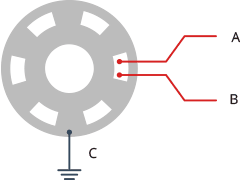
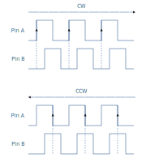

---
title: "Instrukcja laboratorium systemów wbudowanych"
subtitle: "Ćwiczenie 6: Obsługa impulsatora i implementacja termostatu"
author: [Mariusz Chilmon <<mariusz.chilmon@ctm.gdynia.pl>>]
lang: "pl"
titlepage: yes
titlepage-logo: "logo.jpg"
colorlinks: yes
header-includes: |
  \usepackage{awesomebox}
  \usepackage{gensymb}
...

> People think that computer science is the art of geniuses but the actual reality is the opposite, just many people doing things that build on eachother, like a wall of mini stones.
>
> — _Donald Knuth_

# Cel ćwiczenia

Celem ćwiczenia jest zapoznanie się z:

* działaniem impulsatora,
* sterowaniem elementem wykonawczym na podstawie zadanych wytycznych,
* realizacją prostego interfejsu użytkownika.

# Uruchomienie programu wyjściowego

1. Umieść zworki na pinach `RS`, `E` i `D4`…`D7` złącza `J10` (na lewo od buzzera).
1. Zworkę `J15` (nad buzzerem) ustaw w pozycji `RW->GND`.
1. Umieść wyświetlacz w złączu `DIS1`.
1. Podłącz pin `1WIRE` pod wyświetlaczem siedmiosegmentowym LED do pinu `PD0` mikrokontrolera.
1. Podłącz pin `ENC0 B` pod wyświetlaczem siedmiosegmentowym LED do pinu `PD1` mikrokontrolera.
1. Podłącz pin `ENC0 A` pod wyświetlaczem siedmiosegmentowym LED do pinu `PD2` mikrokontrolera.
1. Podłącz diodę `LED1` do pinu `PD3` mikrokontrolera.
1. Po włączeniu zasilania wyświetlacz pokaże bieżącą temperaturę `Tcurrent` oraz temperaturę zadaną `Ttarget`. Dioda `LED1` będzie świecić.

# Zadanie podstawowe

## Wymagania funkcjonalne

Celem zadania podstawowego jest oprogramowanie prostego termostatu sterującego grzałką:

1. Kręcenie impulsatorem pozwala zmieniać zadaną temperaturę.
1. Obrócenie impulsatoar o kilka kroków jest zliczane między kolejnymi odświeżeniami stanu wyświetlacza.
1. Termostat włącza diodę LED1, gdy temperatura zadana jest wyższa od bieżącej (symulacja włączenia grzałki).

## Modyfikacja programu

Impulsator to prosty enkoder obrotowy (ang. _rotary encoder_), złożony np. z obrotowej tarczy z fragmentami przewodzącej ścieżki, która zwiera do masy piny `A` i `B`.

{width=200px}

Impulsator na owych pinach generuje przesunięte w fazie przebiegi prostokątne, które pozwalają określić nie tylko stopień obrotu, ale także jego kierunek. Mimo że kształt przebiegów jest zawsze taki sam, zależnie od kierunku obrotu różne zbocza sygnału z pinu `A` interpretowane są jako narastające (lub, zupełnie analogicznie, jako opadające) i przez odczytanie towarzyszącemu im stanu pinu `B` można określić kierunek obrotu — zgodny z ruchem wskazówek zegara (ang. _clockwise_ — _CW_) lub przeciwny do niego (ang. _counterclockwise_ — _CCW_).

{width=320px}

\awesomebox[purple]{2pt}{\faMicrochip}{purple}{Impulsatory są powszechnie stosowane w sprzęcie AGD i RTV, elektronice samochodowej i sterownikach, gdyż umożliwiają szybkie i precyzyjne zmienianie wartości parametrów liczbowych, np. głośności czy temperatury, a także wygodną nawigację po menu.}

1. Włącz przerwanie `INT0` w metodzie `Encoder::init()`. Przerwanie może reagować na zbocze narastające lub opadające — wedle uznania.
1. W obsłudze przerwania `INT0` w pliku `encoder.cpp` rozpoznaj kierunek obrotu impulsatora przez sprawdzenie stanu pinu `ENC0 B` impulsatora (pin `PD1` mikrokontrolera).
1. W metodzie `Enocder::pop()` zwracaj liczbę obrotów zliczoną w przerwaniu od osatniego wywołania `Encoder::pop()`. Pamiętaj o wyzerowaniu tego licznika, by rozpocząć liczenie od nowa.
1. W metodzie `Thermostat::onTemperature()` porównaj temperaturę zadaną z bieżącą i&nbsp;stosownie do tego włączaj lub wyłączaj LED, symulującą grzałkę.

\awesomebox[violet]{2pt}{\faBook}{violet}{Przypomnij sobie, które rejestry zawierają pola \lstinline{ISC00} (\textit{Interrupt Sense Control}) i \lstinline{INT0}. Nie musisz pamiętać o funkcji \lstinline{sei()}, gdyż globalna flaga przerwań jest już ustawiana w~pętli głównej.}

\awesomebox[teal]{2pt}{\faCode}{teal}{W metodzie \lstinline{Encoder::pop()} warto wykorzystać blok 	\lstinline{ATOMIC_BLOCK(ATOMIC_RESTORESTATE)}. Wyłącza on tymczasowo obsługę przerwań, dzięki czemu można bezpiecznie odczytać i wyzerować licznik impulsów bez obawy, że w~międzyczasie przerwanie \lstinline{INT0} go zmodyfikuje.}

\awesomebox[purple]{2pt}{\faMicrochip}{purple}{Wadą impulsatorów, jak innych elementów stykowych, jest problem drgań styków. W~stosowanej w ćwiczeniu płytce ewaluacyjnej do impulsatora podłączone są filtry RC, tłumiące te drgania. Może jednak okazać się, że stałe czasowe filtrów są za małe, co objawi się gwałtownymi przeskokami wartości podczas obracania impulsatora oraz błędami w~określaniu kierunku obrotu (podobne zjawisko można zaobserwować w rzeczywistych urządzeniach, gdy impulsator ulegnie zużyciu). W takiej sytuacji należy odkomentować na końcu przerwania \lstinline{INT0} metodę \lstinline{debounce()} klasy \lstinline{EncoderDebouncer}, która wyłącza na 122~ms przerwanie \lstinline{INT0}, umożliwiając wygaśnięcie drgań bez wywoływania tegoż przerwania.}

# Zadanie rozszerzone

## Wymagania funkcjonalne

Celem zadania rozszerzonego jest poprawa wygody korzystania z wyświetlacza i utrudnienie przypadkowej zmiany temperatury zadanej:

1. Wyświetlacz odświeżany jest z częstotliwością 5Hz zamiast 1Hz, żeby zapewnić szybszą reakcję na zmianę temperatury i kręcenie impulsatorem.
1. Wciśnięcie impulsatora zmienia symbol `=` obok temperatury zadanej na symbol `>`.
1. Kolejne wciśnięcie impulsatora zmienia symbol `>` obok temperatury zadanej z powrotem na symbol `=`.
1. Zmiana temperatury zadanej możliwe jesty tylko, gdy wyświetlany jest symbol `>`.

## Konfiguracja sprzętowa

1. Podłącz pin `ENC0 SW` pod wyświetlaczem siedmiosegmentowym LED do pinu `PD4` mikrokontrolera.

## Modyfikacja programu

1. Zmień stałą `SYSTEM_TICK_INTERVAL`, tak by zegar systemowy odliczał 200&nbsp;ms zamiast 1&nbsp;s.
1. W metodzie `Encoder::isSwitchPressed()` zwracaj bieżący stan przycisku impulsatora.
1. Zmodyfikuj pętlę główną tak, by reagować na wciśnięcie przycisku impulsatora stosownie do wytycznych.

